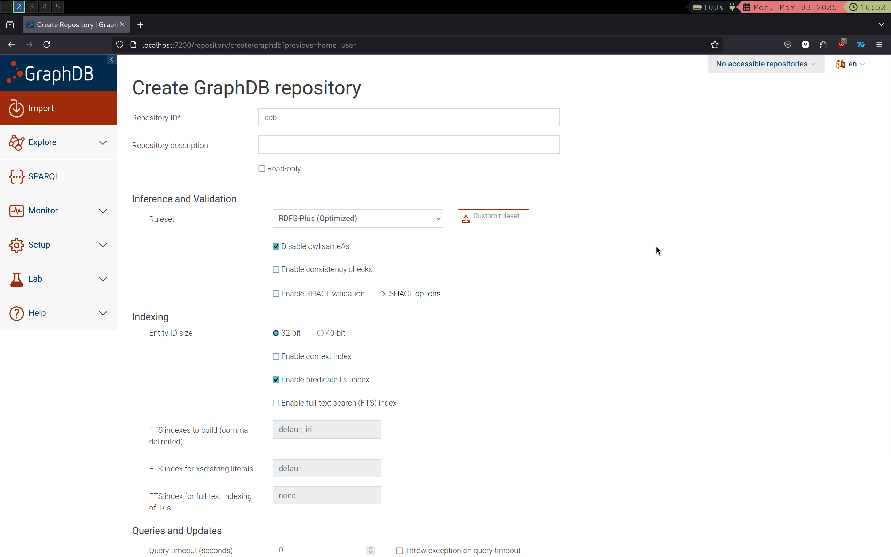
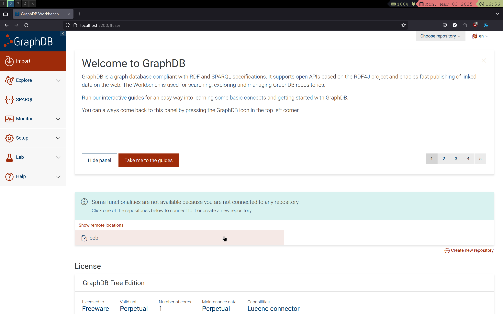
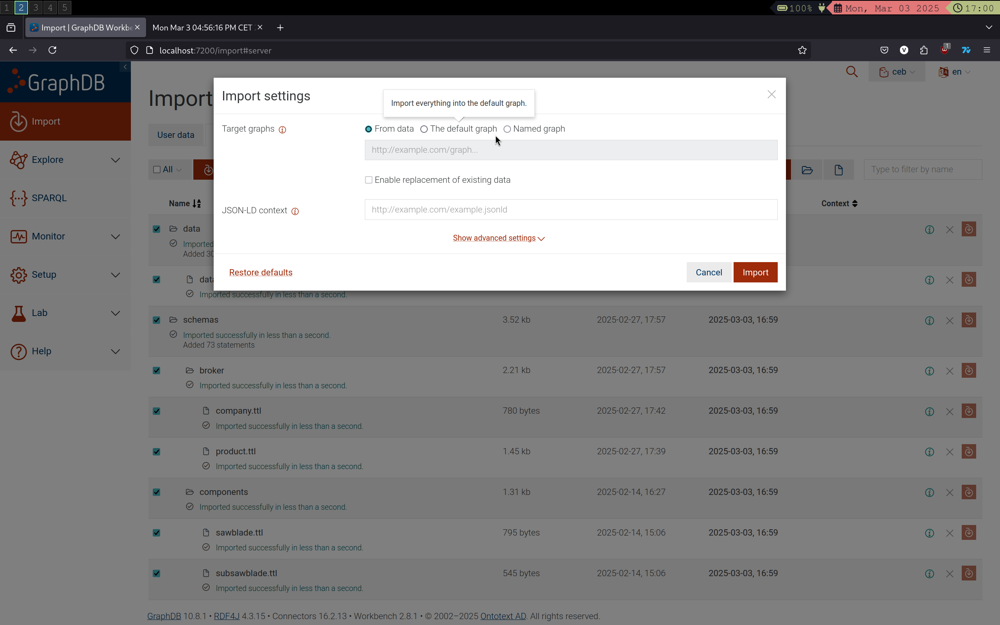
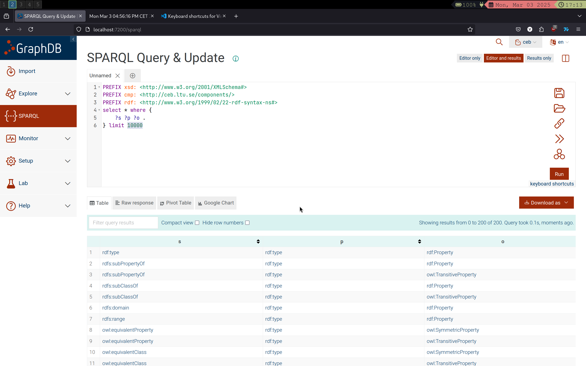

# Instruction for starting GraphDB

## Start docker
`docker-compose up`

## Open web browser of your choice and go to Graphdb (firefox recommended)
Enter: `localhost:7200`


Here Click on `Import` and then `Create new repository` next to the plus sign. 

Then click on `GraphDB repository`

Here you want to enter `ceb` as the repositoryID as seen below and then click on `create` at bottom right of the page



### Importing the server data to graphDB repo

click on ceb repository


And then on `import rdf data`

Now click on the `Server files` tab and select all and then click on `import`

Leave the import settings as default and it should look like as seen in the picture below:


If everyting looks right you can click on import. 

## Test if import actually worked 

Click on the SparQL tab on the left and run the default query. If the query for some reason is not autofilled you can copy it from here: 
```PREFIX xsd: <http://www.w3.org/2001/XMLSchema#>
PREFIX cmp: <http://ceb.ltu.se/components/>
PREFIX rdf: <http://www.w3.org/1999/02/22-rdf-syntax-ns#>
select * where {
    ?s ?p ?o .
} limit 10000
```

If everything is done correctly it should look something like this: 
